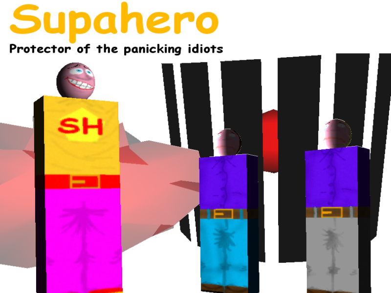

# SUPAHERO - PROTECTOR OF THE PANICKING IDIOTS

Developed for the very first Ludum Dare 48-hour compo, back in 2002.
This was my first game jam, and the theme was "Guardian".
Don't recall how many submitted, but this horrible thing ranked 13th overall, with 2nd for sound.

This was done from scratch, engine and all, during the 48 hours, using C++, DirectX 9.0, DevIL and FMOD.

I've uploaded this for historical reasons, I doubt it is possible to make it compile again without a huge ammount of effort!

## Licenses

- Code by Diogo de Andrade, licensed under the [MIT] license.
- All remaining art by Diogo de Andrade, available throught the [CC0] license.

## Metadata

- Autor: [Diogo Andrade]

[Diogo Andrade]:https://github.com/DiogoDeAndrade
[Dall-E]:https://openai.com/dall-e-3
[Synty Studios]:https://www.syntystudios.com/
[NetSysFire]:https://opengameart.org/users/netsysfire
[CC0]:https://creativecommons.org/publicdomain/zero/1.0/
[Forced Square]:https://www.dafont.com/pt/forced-square.font
[retro 3d look]:https://github.com/DiogoDeAndrade/dithered_palette
[MIT]:LICENSE
